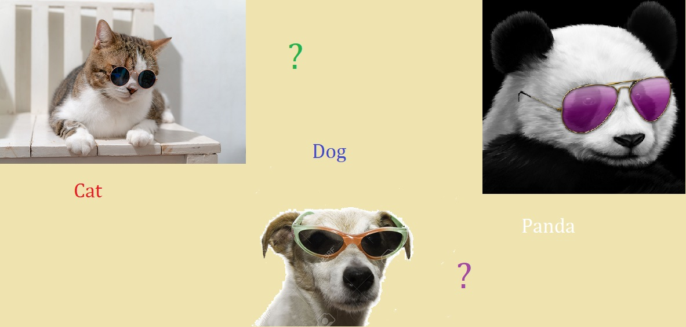
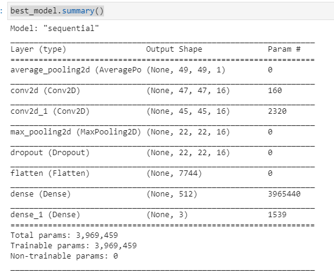

# Simple-Image-Classifier
Model that able to distinguish picture between dog, cat, or panda.

  

Dataset were taken from <a href ='https://www.kaggle.com/ashishsaxena2209/animal-image-datasetdog-cat-and-panda'>Kaggle</a>

Dataset contains 1000 pictures of cats, dogs, and pandas. Then I divided into train : test with test_size ratio of 0.2

This model were make using keras - tensorflow with Sequential model

Here is the summary :

This model is able to predict with up to 71% accuracy.

As I will keep learning about deep learning, I believe this model's accuracy STILL can be improved.

#### Thankyou and Happy Coding :)
