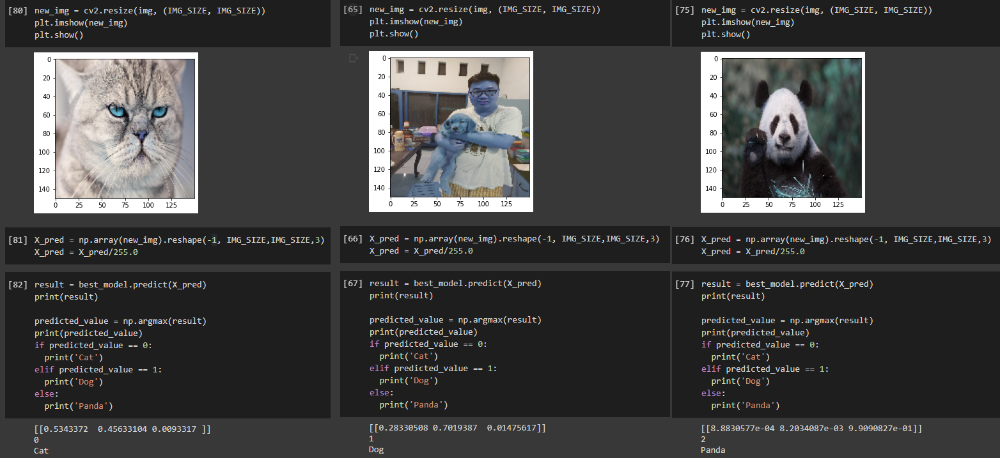

# Simple-Image-Classifier
Model that able to distinguish picture between dog, cat, or panda.

Dataset were taken from <a href ='https://www.kaggle.com/ashishsaxena2209/animal-image-datasetdog-cat-and-panda'>Kaggle</a>

How to run this code : 
1. Download the dataset from kaggle
2. Upload the downloaded picture to your google drive
3. Open the ipynb in __Google Colab__, else the running time will be very long
4. Set the running type into GPU
5. Change the file directory of data to where you save the dataset in your drive
6. Run the code

Dataset contains 1000 pictures of cats, dogs, and pandas. Then I divided into train : test with test_size ratio of 0.2. Since I used google colab, I decided to greed it out and use colorfull picture, which is actually 3 times bigger than grey color picture.

This model were make using keras - tensorflow with Sequential model

Here is the summary :

 
                                        
Result :  
  

Confusion matrix : 
 
This model is able to predict with up to 73% accuracy. 
The problem is this model was not so smart when differentiating cat and dog.  
But, since I choose color picture, it is able to detect panda better than the other. 
As I will keep learning about deep learning, I believe this model's accuracy STILL can be improved.

### Thankyou and Happy Coding :)
